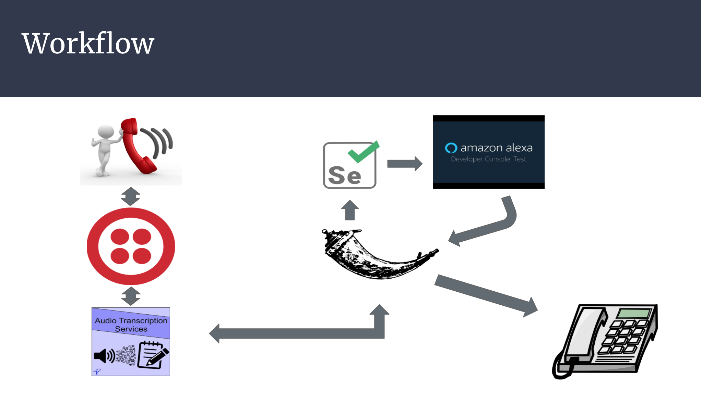

# SmartCustomerService
Implementing Amazon's Alexa into a customer service platform

## How to use

python resetCookie.py
python startVoice.py
python getCall.py
./ngrok http 5000
Go to Twilio and change endpoint

